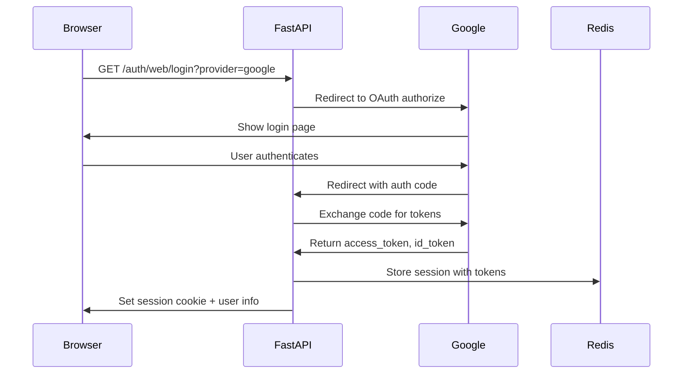

# FastAPI Authentication with OIDC and the BFF Pattern

This guide explains how API Forge implements FastAPI authentication using OIDC (OpenID Connect) providers with a Backend-for-Frontend (BFF) pattern. You'll learn how the session-based authentication flow works, how sessions are securely stored in Redis, and how web clients integrate with this FastAPI authentication system.

## Overview

API Forge provides a complete FastAPI authentication solution using:

- **OIDC Authentication** - Integration with Google, Microsoft, and Keycloak
- **BFF Pattern** - Backend-for-Frontend approach for web applications
- **Session-based Auth** - Secure, HttpOnly cookies with Redis storage
- **CSRF Protection** - Double-submit cookie pattern
- **Client Fingerprinting** - Additional security layer for session validation
- **Automatic Token Refresh** - Transparent OIDC token refresh

This approach is designed for web applications where the FastAPI backend handles all authentication complexity, issuing secure session cookies to browser clients.

## When to Use This

Use the BFF authentication pattern when:

- Building web applications with JavaScript frontends (React, Vue, Angular, etc.)
- You need to support multiple OIDC providers (Google, Microsoft, enterprise SSO)
- Your frontend cannot securely store OAuth tokens
- You want centralized session management and security policies
- You need server-side session invalidation

For mobile or native apps, consider adding JWT token-based auth endpoints alongside the BFF pattern.

## How It Works

### Authentication Flow

1. **User clicks "Login with Google"** in your web app
2. Frontend redirects to FastAPI: `GET /auth/web/login?provider=google`
3. FastAPI redirects to Google's OAuth authorization page
4. User authenticates with Google and approves scopes
5. Google redirects back to FastAPI: `GET /auth/web/callback?code=...&state=...`
6. FastAPI exchanges authorization code for tokens
7. FastAPI creates a session in Redis with user info and tokens
8. FastAPI sets secure, HttpOnly session cookie
9. Frontend receives user info and CSRF token
10. Frontend includes CSRF token in subsequent API requests



### Session Structure

Sessions are stored in Redis with the following structure:

```python
{
    "session_id": "sess_abc123...",
    "user_id": "google_110248495921238986420",
    "provider": "google",
    "email": "user@example.com",
    "name": "John Doe",
    "access_token": "ya29.a0AfH6...",
    "id_token": "eyJhbGciOiJSUzI1...",
    "refresh_token": "1//0gNW4k5...",
    "expires_at": 1731801600,
    "fingerprint_hash": "a7f3c2d1...",
    "created_at": 1731798000,
    "last_activity": 1731798000
}
```

The session cookie contains only the `session_id` - all sensitive data stays server-side in Redis.

## Configuration

### OIDC Provider Setup

Configure OIDC providers in `config.yaml`:

```yaml
oidc:
  providers:
    google:
      enabled: true
      client_id: ${OIDC_GOOGLE_CLIENT_ID}
      client_secret: ${OIDC_GOOGLE_CLIENT_SECRET}
      scopes:
        - openid
        - email
        - profile
      
    microsoft:
      enabled: true
      client_id: ${OIDC_MICROSOFT_CLIENT_ID}
      client_secret: ${OIDC_MICROSOFT_CLIENT_SECRET}
      scopes:
        - openid
        - email
        - profile
      
    keycloak:
      enabled: ${KEYCLOAK_ENABLED:-false}
      issuer: ${KEYCLOAK_ISSUER:-http://localhost:8080/realms/test-realm}
      client_id: ${OIDC_KEYCLOAK_CLIENT_ID:-test-client}
      client_secret: ${OIDC_KEYCLOAK_CLIENT_SECRET}
      scopes:
        - openid
        - email
        - profile
```

### Environment Variables

Set these in your `.env` file:

```bash
# Google OAuth
OIDC_GOOGLE_CLIENT_ID=your-client-id.apps.googleusercontent.com
OIDC_GOOGLE_CLIENT_SECRET=GOCSPX-...

# Microsoft OAuth
OIDC_MICROSOFT_CLIENT_ID=12345678-1234-1234-1234-123456789012
OIDC_MICROSOFT_CLIENT_SECRET=...

# Session secrets (REQUIRED - change from defaults!)
SESSION_SIGNING_SECRET=your-secret-key-min-32-chars
CSRF_SIGNING_SECRET=your-csrf-secret-min-32-chars
```

### Redirect URIs

Register these redirect URIs with your OIDC providers:

- **Development**: `http://localhost:8000/auth/web/callback`
- **Production**: `https://yourdomain.com/auth/web/callback`

## API Endpoints

### Login Initiation

```http
GET /auth/web/login?provider=google
```

Parameters:
- `provider` - OIDC provider name (`google`, `microsoft`, `keycloak`)
- `redirect_uri` (optional) - Where to redirect after successful login

Response: HTTP 302 redirect to OIDC provider

### OAuth Callback

```http
GET /auth/web/callback?code=...&state=...
```

This endpoint is called by the OIDC provider. It exchanges the authorization code for tokens, creates a session, and redirects to your frontend.

Response:
```json
{
  "user": {
    "user_id": "google_110248495921238986420",
    "email": "user@example.com",
    "name": "John Doe",
    "provider": "google"
  },
  "csrf_token": "csrf_abc123..."
}
```

### Get Current User

```http
GET /auth/me
Cookie: session=sess_abc123...
X-CSRF-Token: csrf_abc123...
```

Response:
```json
{
  "user_id": "google_110248495921238986420",
  "email": "user@example.com",
  "name": "John Doe",
  "provider": "google"
}
```

### Logout

```http
POST /auth/web/logout
Cookie: session=sess_abc123...
X-CSRF-Token: csrf_abc123...
```

Response:
```json
{
  "message": "Logged out successfully"
}
```

The session is deleted from Redis and the cookie is cleared.

## Frontend Integration

### React Example

```typescript
// Login button
function LoginButton() {
  const handleLogin = (provider: string) => {
    // Redirect to FastAPI login endpoint
    window.location.href = `http://localhost:8000/auth/web/login?provider=${provider}`;
  };
  
  return (
    <div>
      <button onClick={() => handleLogin('google')}>
        Login with Google
      </button>
      <button onClick={() => handleLogin('microsoft')}>
        Login with Microsoft
      </button>
    </div>
  );
}

// After redirect back from OAuth
useEffect(() => {
  // FastAPI redirects to /auth-callback with user data
  const params = new URLSearchParams(window.location.search);
  const userData = params.get('user');
  const csrfToken = params.get('csrf_token');
  
  if (userData && csrfToken) {
    // Store CSRF token for API requests
    localStorage.setItem('csrf_token', csrfToken);
    // Parse and store user data
    setUser(JSON.parse(userData));
  }
}, []);

// Making authenticated API requests
async function fetchUserData() {
  const csrfToken = localStorage.getItem('csrf_token');
  
  const response = await fetch('http://localhost:8000/api/some-endpoint', {
    credentials: 'include', // Include session cookie
    headers: {
      'X-CSRF-Token': csrfToken,
      'Content-Type': 'application/json'
    }
  });
  
  return response.json();
}
```

### Vue Example

```javascript
// Composition API
import { ref, onMounted } from 'vue';

export function useAuth() {
  const user = ref(null);
  const csrfToken = ref(localStorage.getItem('csrf_token'));
  
  const login = (provider) => {
    window.location.href = `http://localhost:8000/auth/web/login?provider=${provider}`;
  };
  
  const logout = async () => {
    await fetch('http://localhost:8000/auth/web/logout', {
      method: 'POST',
      credentials: 'include',
      headers: {
        'X-CSRF-Token': csrfToken.value
      }
    });
    
    user.value = null;
    csrfToken.value = null;
    localStorage.removeItem('csrf_token');
  };
  
  const fetchUser = async () => {
    try {
      const response = await fetch('http://localhost:8000/auth/me', {
        credentials: 'include',
        headers: {
          'X-CSRF-Token': csrfToken.value
        }
      });
      
      if (response.ok) {
        user.value = await response.json();
      }
    } catch (error) {
      console.error('Failed to fetch user:', error);
    }
  };
  
  onMounted(fetchUser);
  
  return {
    user,
    login,
    logout
  };
}
```

## Security Features

### HttpOnly Cookies

Session cookies are marked `HttpOnly`, preventing JavaScript access and protecting against XSS attacks:

```python
response.set_cookie(
    key="session",
    value=session_id,
    httponly=True,      # Cannot be accessed by JavaScript
    secure=True,        # Only sent over HTTPS in production
    samesite="lax",     # CSRF protection
    max_age=86400       # 24 hours
)
```

### CSRF Protection

API Forge implements double-submit cookie pattern:

1. A CSRF token is returned to the client after login
2. Client stores the token (localStorage or state)
3. Client includes the token in the `X-CSRF-Token` header
4. FastAPI validates that the token matches the session

Protected endpoints require both:
- Valid session cookie
- Matching CSRF token

### Client Fingerprinting

Sessions include a fingerprint hash derived from:

- User-Agent header
- Accept-Language header
- IP address (optional, can be disabled)

If the fingerprint changes (e.g., different browser), the session is invalidated. This provides protection against session theft.

Configure fingerprinting in `config.yaml`:

```yaml
app:
  sessions:
    security:
      enable_client_fingerprinting: true
      strict_fingerprinting: true  # Reject on mismatch vs. warn
```

### Session Rotation

Sessions are automatically rotated after authentication events:

- New session ID issued after login
- Old session ID invalidated
- Prevents session fixation attacks

### Token Refresh

FastAPI automatically refreshes OIDC access tokens when they expire:

1. Request arrives with expired access token
2. FastAPI uses refresh token to get new access token
3. Session in Redis updated with new token
4. Request continues transparently

This happens server-side - the client never sees or handles refresh tokens.

## Development Setup

### Keycloak Test Environment

For local development, API Forge includes a Keycloak instance with pre-configured test users:

```bash
# Start development environment
uv run my-project-cli dev start-env

# Keycloak will be available at http://localhost:8080
# Test users:
#   - testuser1@example.com / password123
#   - testuser2@example.com / password123
```

Login with Keycloak:
```
http://localhost:8000/auth/web/login?provider=keycloak
```

## Troubleshooting

### "Invalid state parameter" Error

The `state` parameter prevents CSRF attacks on the OAuth flow. This error means:

- The state cookie expired (check `auth_session_ttl_seconds` in config)
- The state was tampered with
- Browser cookies are disabled

Solution: Increase `auth_session_ttl_seconds` or check browser cookie settings.

### "CSRF token mismatch" Error

The CSRF token doesn't match the session. Common causes:

- Client didn't include `X-CSRF-Token` header
- Token expired (check `csrf_token_max_age_hours`)
- Session was rotated but client has old token

Solution: Refresh the CSRF token by calling `GET /auth/me` after login.

### "Session expired" or 401 Errors

Session may have expired or been invalidated:

- Sessions expire after `max_age` (default 24 hours)
- Sessions invalidate on logout
- Client fingerprint changed (browser/device changed)

Solution: Redirect user to login again.

## Related Documentation

- [Sessions and Cookies](./fastapi-sessions-and-cookies.md) - Deep dive into session security
- [Docker Dev Environment](./fastapi-docker-dev-environment.md) - Set up Keycloak for local testing
- [Clean Architecture Overview](./fastapi-clean-architecture-overview.md) - How auth integrates with services

## Additional Resources

- [OAuth 2.0 RFC](https://datatracker.ietf.org/doc/html/rfc6749)
- [OpenID Connect Specification](https://openid.net/specs/openid-connect-core-1_0.html)
- [BFF Pattern](https://datatracker.ietf.org/doc/html/draft-ietf-oauth-browser-based-apps)
